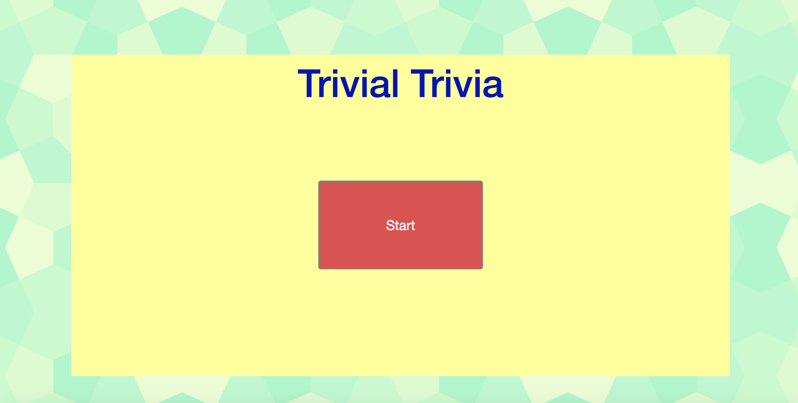

# Trivial Trivia Game

Want to play a little game? Want to see how much you knwo about TV and movies? I developed this simple trivia with Ajax requests for the Open Trivia Database and the use of Timers to make a little fun game. 

## Getting Started

All you have to do to play is go to https://cesarc770.github.io/TriviaGame/ and press Start!

### Prerequisites

You can run this form any browser and if you wish to clone it or downloaded just click on the index.html file.

## Built With

* HTML, CSS, jQuery, AJAX
* Open Trivia Database API - https://opentdb.com/

## Authors

* **Cesar Caceres** - *Design and Development* 

## Acknowledgments

* Thanks to Open Trivia Databse Api for making my world a lot easier. 

